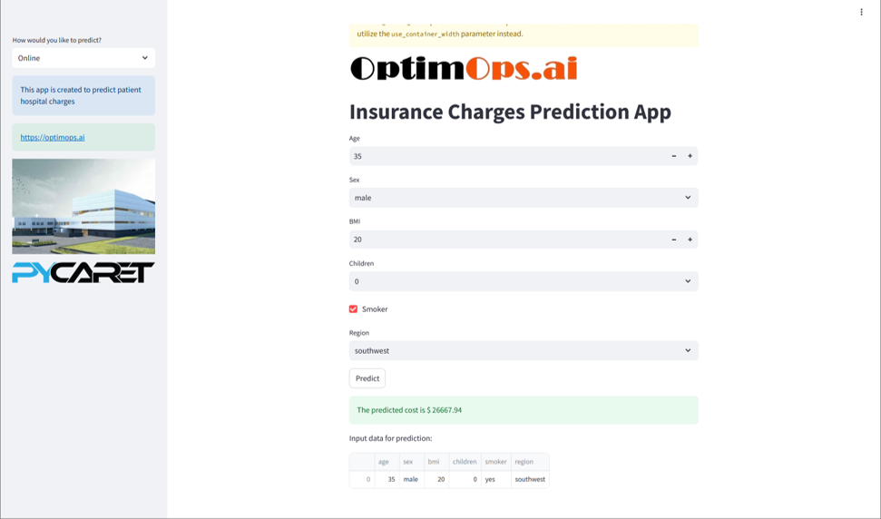

# 🧠 Insurance Charges Prediction App (Streamlit + XGBoost)

A fast and interactive web application built using **Streamlit**, this app predicts insurance charges based on user health and demographic inputs. It leverages an **XGBoost** model trained on real-world data and features an intuitive UI for quick experimentation.



## 🚀 Features

- Predict insurance charges based on:
  - Age, Gender, BMI
  - Smoking Status
  - Number of Children
  - Region
- Trained XGBoost model using `insurance.csv` dataset
- Preprocessing includes:
  - One-hot encoding for categorical fields
  - MinMaxScaler for numerical inputs
- Real-time prediction output with result messaging
- Multiple language support (English, 中文)

## 🧰 Tech Stack

- **Frontend:** Streamlit
- **Model:** XGBoost
- **Preprocessing:** scikit-learn
- **Language:** Python

## 📂 Folder Structure

```
insurance-app/
├── app.py                  # Main Streamlit app
├── model_training.py       # Model training script
├── xgb_model.pkl           # Trained XGBoost model
├── scaler.pkl              # Fitted MinMaxScaler
├── encoder.pkl             # Fitted OneHotEncoder
├── assets/
│   └── insurance-app-screenshot.png
├── requirements.txt
└── README.md
```

## ▶️ Running Locally

```bash
pip install -r requirements.txt
streamlit run app.py
```

**Visit:** http://localhost:8501

## 🌐 Deployment Options

You can deploy this app to:

- Streamlit Community Cloud
- Heroku
- Alibaba Cloud ECS
- Docker
- AWS EC2

## 📊 Sample Prediction Output

- **Inputs:** 35 yrs old, BMI: 24.5, Smoker: No, Region: southeast
- **Predicted Insurance Charge:** $7,852.34

## 🔒 Note

Ensure the following files are in the same directory as `app.py` when running:

- `xgb_model.pkl`
- `scaler.pkl`
- `encoder.pkl`

## 📬 Contact

Feel free to fork or contribute. For bugs or suggestions, please open an issue or submit a PR!